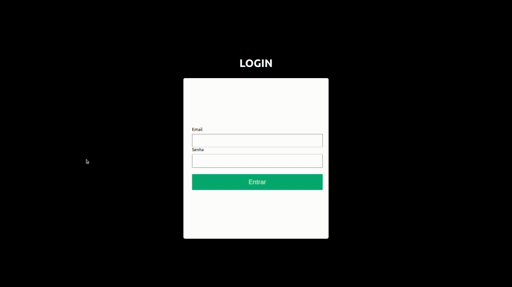

<div align="center">

#   Trybewallet
[](https://github.com/ocarlosbarros/trybewallet "Go to GitHub repo")


[](https://github.com/ocarlosbarros/trybewallet)
[](https://github.com/ocarlosbarros/trybewallet)


</div>

# :clipboard: Table of Contents

* [About Project](#point_right-about-project)
    * [Features](#heavy_check_mark-features)
    * [Screenshots](#camera-screenshots)
* [Built With](#hammer_and_wrench-built-with)
    * [Technologies and Libs](#computer-technologies-and-libs)
* [Getting Started](#rocket-getting-started)
    * [Requirements](#warning-requirements)
    * [Run Application](#gear-run-application)
    * [Available Scripts](#robot-available-scripts)
* [Tests](#test_tube-tests)
* [License](#page_facing_up-license)
* [Developers](#octocat-developers)

#   :point_right: About project

The Trybewallet is a currency converter expense control wallet.

##  :heavy_check_mark: Features 

- [x] Login with email in format 'string@string.com'
- [x] Login with password greater and equal 6
- [x] Add, an expense
- [x] View a table with your expenses
- [x] Remove an expense
- [ ]  Edit an expense
- [x] View total spend converted to BRL (Brazilian Real) currency

<p align="right"><a href="#trybewallet">back to top</a></p>

##  :camera: Screenshots 

### Login


### Wallet


<p align="right"><a href="#trybewallet">back to top</a></p>

#   :hammer_and_wrench: Built with 

This project was bootstrapped with Create React App.

* ##    :computer: Technologies and Libs 
    - React
    - React Icon
    - React Router
    - React Redux
    - Redux
    - Redux Devtools Extension
    - Redux Thunk
    - Stylelint

<p align="right"><a href="#trybewallet">back to top</a></p>

#   :rocket: Getting Started 

These instructions will allow you to get a copy of the project on your local machine for development and testing purposes.

##  :warning: Requirements 

Before starting, you need to have Node.js and Git installed on your computer. You can download them at
https://nodejs.org and https://git-scm.com/downloads. 

Check that the installations were successful by running the command in terminal.

```
node -v & git --version
```

This command should return node and git version installed in your computer.

<p align="right"><a href="#trybewallet">back to top</a></p>

##  :gear: Run Application 

1. Clone project
    ```
    git clone https://github.com/ocarlosbarros/trybewallet.git
    ```

2. Access project folder
    ```
    cd trybewallet
    ```

3. Install dependencies
    ```
    npm install
    ```

4. Run project
    ```
    npm start
    ```

<p align="right"><a href="#trybewallet">back to top</a></p>

## :robot: Available Scripts 

In the project directory, you can run:

```
npm start
```
Runs the app in the development mode. Open http://localhost:3000 to view it in your browser.

```
npm test
```
Launches the test runner in the interactive watch mode. See the section about [Tests](#tests).

```
npm run build
```
Builds the app for production to the build folder.

```
npm run eject
```
If you aren’t satisfied with the build tool and configuration choices, you can eject at any time. This command will remove the single build dependency from your project. More information in [Create React App Doc](https://create-react-app.dev/docs/available-scripts/#npm-run-eject)

<p align="right"><a href="#trybewallet">back to top</a></p>

##  :test_tube: Tests 

To run tests, run the following command

```
npm test
```

<br/>

<p align="right"><a href="#trybewallet">back to top</a></p>

#   :page_facing_up: License 

Trybewallet is MIT Licensed. See ```LICENSE.md``` for more information.

<br/>

<p align="right"><a href="#trybewallet">back to top</a></p>

# :octocat: Developers 

<a href="https://ocarlosbarros.github.io" target="_blank">
 <div>
    
    <br />
    <p style="margin-left:10px"><b>Carlos Barros</b></p>
 </div>
 </a> 

Developed with 💜 by Carlos Barros

<div align="left">
<a href="https://www.linkedin.com/in/ocarlosbarros" target="_blank"></a>
<a href = "mailto:carlos_dbs@hotmail.com"></a>
<a href="https://www.instagram.com/o_carlosbarros.dev/" target="_blank"></a>
<a href="https://www.youtube.com/channel/UC1xY9hXr4h_77rfKKk-i3Vg" target="_blank"></a>
</div>

<p align="right"><a href="#trybewallet">back to top</a></p>


