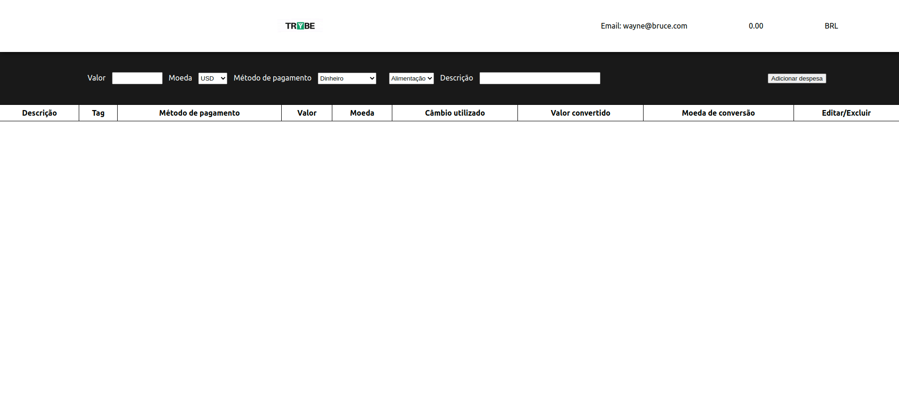

# TrybeWallet

# Requirements

Before starting, you need to have Node.js installed on your computer. You can download it at
https://nodejs.org. Check if the installation was successful by running the command in terminal.

```
node -v

```

This command should return node version installed in your computer.

# Getting Started with Create React App

This project was bootstrapped with Create React App.

## Acess project folder

```
cd trybewallet
```

## Install dependencies

```
npm install
```

### Available Scripts

In the project directory, you can run:

```
npm install && npm start
```

```
npm run build
```

```
npm test
```

```
npm run eject
```

# Technologies and Libs

- React
- React Icon
- React Router
- React Redux
- Redux
- Redux Devtools Extension
- Redux Thunk
- Stylelint

# Screenshots

## Login


## Wallet



# Features

# Step by Step

This project was created with React - Redux and 💜
